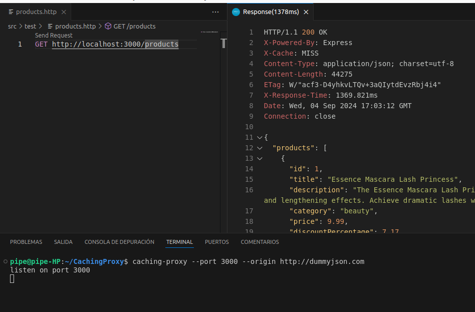
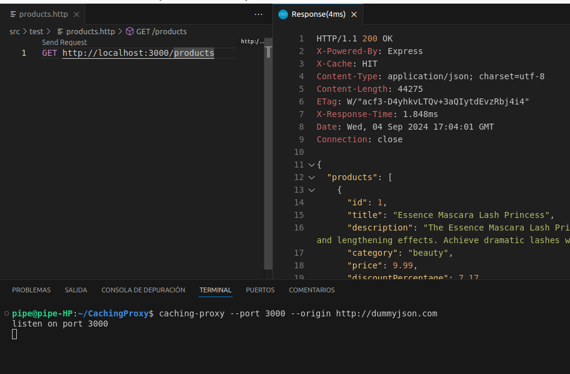

# Caching Proxy

https://roadmap.sh/projects/caching-server

Este es un simple proxy HTTP con caching implementado en Node.js usando Express. Permite realizar solicitudes a una URL de origen, cachear las respuestas y servirlas con un encabezado HTTP que indica si la respuesta proviene del cache.

## Estructura del Proyecto


- **/src**: Contiene el código fuente principal del proyecto.
  - **caching-proxy.js**: Archivo principal del servidor donde se configura y se inicia la aplicación Express.
  - **/routes**: Carpeta que contiene módulos de rutas.
    - **products.js**: Módulo de rutas para manejar las solicitudes GET a `/products`.

- **/tests**: Carpeta opcional para archivos de prueba.
  - **products.http**: Archivo usado para realizar pruebas manuales de los endpoints HTTP.

- **package.json**: Archivo de configuración de npm que incluye dependencias, scripts y configuración del proyecto.

- **README.md**: Archivo de documentación que explica cómo configurar y utilizar el proyecto.


## Requisitos Previos

- [Node.js](https://nodejs.org/) (v14 o superior)
- [npm](https://www.npmjs.com/)

## Instalación

1. Clona el repositorio:

    ```bash
    git clone https://github.com/katarro/CachingProxy
    cd CachingProxy
    ```

2. Instala las dependencias:

    ```bash
    npm install
    ```

3. Haz que el script principal sea ejecutable:

    ```bash
    chmod +x src/caching-proxy.js
    ```

4. Enlaza el comando globalmente usando `npm link`:

    ```bash
    npm link
    ```

## Uso

Para iniciar el servidor, usa el comando `caching-proxy` seguido de los argumentos `--port` y `--origin`:

```bash
caching-proxy --port <number> --origin <url>
```

## Ejemplo
```
caching-proxy --port 3000 --origin http://dummyjson.com
```

## Argumentos
- --port: Puerto en el que el servidor escuchará las solicitudes. 
- --origin: URL de origen para las solicitudes HTTP.


## Explicación del Código

### 1. Archivo Principal: `src/caching-proxy.js`

- Configura un servidor Express.
- Usa el paquete `commander` para manejar argumentos de línea de comandos.
- Establece las rutas utilizando archivos modulares.
- Usa `app.locals` para compartir la URL de origen con otros módulos.
- Usa `response-time` para medir y registrar el tiempo de respuesta del servidor.

### 2. Rutas: `src/routes/products.js`

- Define una ruta `GET` para `/products`.
- Verifica si la respuesta está en cache usando `node-cache`.
- Si la respuesta está en cache, devuelve la respuesta cacheada con el encabezado `X-Cache: HIT`.
- Si no está en cache, realiza una solicitud a la URL de origen, cachea la respuesta y devuelve la respuesta con el encabezado `X-Cache: MISS`.

### 3. Pruebas: `tests/products.http`

- Archivo de prueba para realizar solicitudes HTTP manuales (opcional).
- Útil para probar rápidamente los endpoints durante el desarrollo.

## Fotos de Pruebas

Aquí se presentan algunas capturas de pantalla y ejemplos de uso del proyecto.

### Prueba 1: Solicitud a `/products` con Cache MISS


*En esta imagen se muestra una solicitud al endpoint `/products` con una respuesta cacheada como MISS, indicando que los datos se obtuvieron de la URL de origen y no estaban en cache. El tiempo de respuesta fue de `1369 ms`.*


### Prueba 2: Solicitud a `/products` con Cache HIT

*En esta imagen se muestra una solicitud al endpoint `/products` con una respuesta cacheada como HIT, lo que significa que los datos se obtuvieron directamente del cache, mejorando el tiempo de respuesta a `1.8 ms`, logrando un aumento de velocidad del `99.8%`.*


## Cálculo del Aumento de Velocidad


El aumento de velocidad al usar el cache se calcula con la siguiente fórmula:

- Mejora (%) = (1 - (Tiempo con HIT / Tiempo con MISS)) * 100

- Mejora (%) = (1 - (1.8 / 1369)) * 100

- Mejora (%) ≈ 99.87%

Esto demuestra que utilizar cache puede mejorar drásticamente los tiempos de respuesta, reduciendo el tiempo de espera de los usuarios y mejorando la eficiencia de las solicitudes.


## Licencia

Este proyecto está bajo la Licencia MIT. Consulta el archivo `LICENSE` para más detalles.

